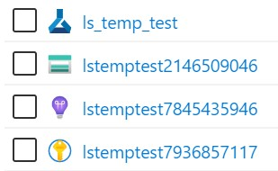

# Getting Started with Azure Maching Learning


## Labs Overview

> These labs focus on the python SDK, interacting with the capabilities of `Azure ML`, from either a cloud VM or a local machine.


## Setup and Provisioning

When creating an instance of AML in your subscription, it will automatically create the following associated services:
- Storage Account
- Key Vault
- App Insights

These follow a naming convention of `youramlservicename`+`unique 10 digit identifier`, where any non-alpha-numeric characters are stripped from your AML service name.



Follow the steps here (initial set up)
https://docs.microsoft.com/en-gb/azure/machine-learning/tutorial-1st-experiment-sdk-setup

## 1. Working from cloud-based Azure Machine Learning compute
Use Tutorial 1 to get familiar with working fully in the cloud. In this tutorial, the data prepation, training orchestration and training steps all happen on the AML compute VM. 
- https://docs.microsoft.com/en-gb/azure/machine-learning/tutorial-1st-experiment-sdk-train

> Note: if there are any difficulties with the Device Login as a result of logging into the wrong (when working on a tenant that is not your default), review this tip: https://gist.github.com/lindacmsheard/010932f7d3b13246cf340e5f1804d5e6.

## 2. Working with a local development environment
For the second tutorial, set up a local development environment for data preparation and orchestration. The training step in this tutorial uses a cluster of VMs in the cloud.

*(Instructions adapated from 
https://docs.microsoft.com/en-gb/azure/machine-learning/how-to-configure-environment#local)*

Start by creating a conda environment.

> If you don't yet have conda on you system, follow the instructions here: https://gist.github.com/lindacmsheard/928b21764d0fa2c1324804de9e38953e

From your conda base environment:
```
conda create -n myenv python=3.6.5
conda activate myenv
```
Install the required packages for this lab into the environment.
```
conda install matplotlib, numpy, scikit-learn=0.22.1
conda install notebook ipykernel
```
Enable jupyter notebook to connect to the conda python kernel. 
```
ipython kernel install --user --name myenv --display-name "Python (myenv)"
```
Add the Azure ML SDK.
```
pip install azureml-sdk[notebooks]
pip install --user azureml-opendatasets
```

Clone the sample tutorial notebooks and navigate `tutorials` subfolder.
```
git clone https://github.com/Azure/MachineLearningNotebooks.git
cd ./MachineLearningNotebooks/tutorials
```

Connect your development environment to your AML instance by downloading the `config.json` file from the portal as per guidance [here](https://docs.microsoft.com/en-gb/azure/machine-learning/how-to-configure-environment#workspace). You can place the file into the tutorials folder, or any parent folder if you would like this config to apply more widely across your projects.

> Note:  When working in an AML Compute VM provisioned from your workspace, such as the one you used in Lab 1 above, the config.json file is pre-loaded into the root directory of the VM to ensure that VM is linked to the Workspace it was provisioned from.

Launch jupyter:
```
jupyter notebook
```
and locate the MNIST tutorial notebooks (`image-classification-mnist-data`) in the jupyter file tree browser. Follow the instructions within the tutotial notebooks.

> TIP: double check the steps you executed above against the pre-requisites specified in each tutorial below. 

- [Part 1 - Train with a cluster](https://github.com/Azure/MachineLearningNotebooks/blob/master/tutorials/image-classification-mnist-data/img-classification-part1-training.ipynb)
    > Note: If your using Microsoft Edge, and not Edge dev or beta, the tutorial video interface may look slightly different. In particular, instead of being able to clone a folder though a three-dot menu on hover to your user folder, you can only clone individual sample notebooks. To do so, open the sample notebook, and then use the blue button above it to clone it and therefore make it editable.

    > TIP: If you are working within the `image-classification-mnist-data` folder of the cloned repo, rename the provided sample model pkl file before continuing to part 2, so that you can distinguish the provided sample from one you will download in Part 1.
    ```
    mv sklearn_mnist_model.pkl sklearn_mnist_model-sample.pkl
    ```
- [Part2 - Deploy Model](https://github.com/Azure/MachineLearningNotebooks/blob/master/tutorials/image-classification-mnist-data/img-classification-part2-deploy.ipynb)


## 3. Learning to work with ML Pipelines
https://docs.microsoft.com/en-gb/azure/machine-learning/tutorial-pipeline-batch-scoring-classification

Update your environment with the following packages
```
conda install pandas requests
```
and 
```
pip install azureml-pipeline-core azureml-contrib-pipeline-steps
```
In the jupyter file tree browser, navigate to the 
[machine-learning-pipelines-advanced](https://github.com/Azure/MachineLearningNotebooks/tree/master/tutorials/machine-learning-pipelines-advanced) folder.

From your local Jupyter instance that you set up in 2. above, complete the following lab:
- https://github.com/Azure/MachineLearningNotebooks/blob/master/tutorials/machine-learning-pipelines-advanced/tutorial-pipeline-batch-scoring-classification.ipynb


# Advanced topics
In the labs above, we looked at integrating with Azure ML from a cloud VM, and from a local development environment. It is also possible to integrate from a spark-environment databricks:

- https://docs.microsoft.com/en-gb/azure/machine-learning/how-to-configure-environment#azure-databricks

Databricks-based notebook samples
- https://github.com/Azure/MachineLearningNotebooks/tree/master/how-to-use-azureml/azure-databricks

Alternatively, databricks can be configured as the compute target:
- https://github.com/Azure/MachineLearningNotebooks/blob/master/how-to-use-azureml/azure-databricks/databricks-as-remote-compute-target/aml-pipelines-use-databricks-as-compute-target.ipynb

Exploring distributed inferencing further:
- https://medium.com/thinkgradient/parallel-inferencing-using-a-fast-ai-model-and-azure-ml-parallelrunstep-d832155f688c


# Reference Links
1. Service Pricing
    - https://azure.microsoft.com/en-gb/pricing/details/machine-learning/ 
2.  Configuring your environment
    - https://docs.microsoft.com/en-gb/azure/machine-learning/how-to-configure-environment
    - Alternative notebook-based instructions for configuring environments: https://github.com/Azure/MachineLearningNotebooks/blob/master/configuration.ipynb

2.  Tutorials
    -	https://docs.microsoft.com/en-gb/azure/machine-learning/tutorial-1st-experiment-sdk-setup
    -	https://docs.microsoft.com/en-gb/azure/machine-learning/tutorial-train-models-with-aml
    -	https://docs.microsoft.com/en-gb/azure/machine-learning/tutorial-deploy-models-with-aml
    - https://docs.microsoft.com/en-gb/azure/machine-learning/tutorial-train-deploy-model-cli 
3.  Notebook Samples 
    - https://github.com/Azure/MachineLearningNotebooks
4.  Python SDK Reference
    - https://docs.microsoft.com/en-gb/python/api/overview/azure/ml/?view=azure-ml-py
5.  Working with your own datasets in Azure ML
    - https://docs.microsoft.com/en-us/azure/machine-learning/how-to-create-register-datasets
6.  Alternative Cloud Compute (provisioned outside of Azure ML, but can integrate with it)
    - DSVM: https://azure.microsoft.com/en-us/services/virtual-machines/data-science-virtual-machines/
    - Azure Notebooks: https://notebooks.azure.com/
    - combine the two: https://docs.microsoft.com/en-us/azure/notebooks/use-data-science-virtual-machine


<hr>

### Troubleshooting

#### Login issues

https://github.com/Azure/azure-cli/issues/6962
This will happen if your account is associated with multiple Azure AD's. It can exist as a member user in one Azure AD, and as a guest user in the other Azure AD. If the Azure AD that you are a guest user in requires MFA, this error will occur.

You can mitigate this by adding logging in via the the Azure AD tenant to the login:
```
az login --tenant [tenantid]
```
To achieve this when using the device login triggered within a jupyter notebook, clear the browser history. Then use the shell access available in the built-in notebook interface to issue to command above, and refresh the page before running the notebook again.


#### SSH access to your VM and Remote VSCode
If you prefer a more native experience when interacting with your cloud VM than the shell access built into the notebook interface in AML, ensure that you select `enable SSH access` when you provision your compute. 
You can then connect Visual Studio Code to work directly on your VM
https://code.visualstudio.com/docs/remote/ssh
